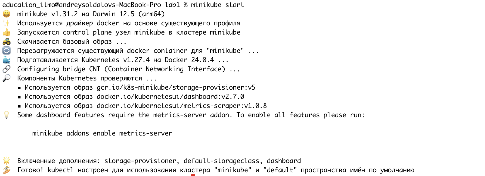
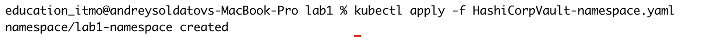
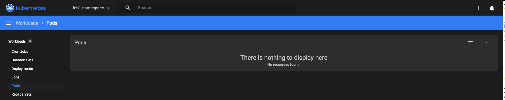
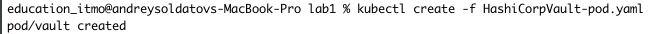
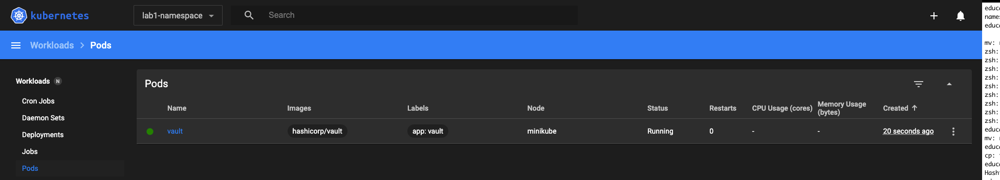
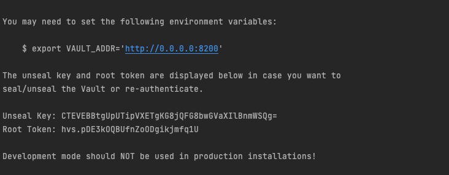
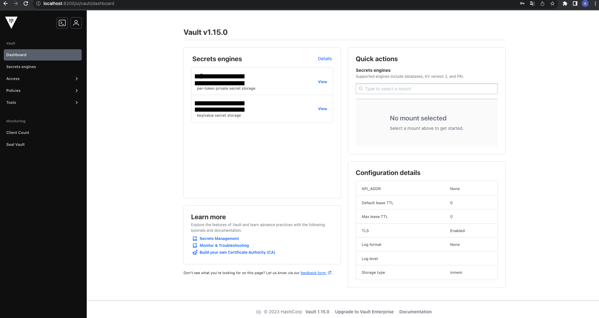
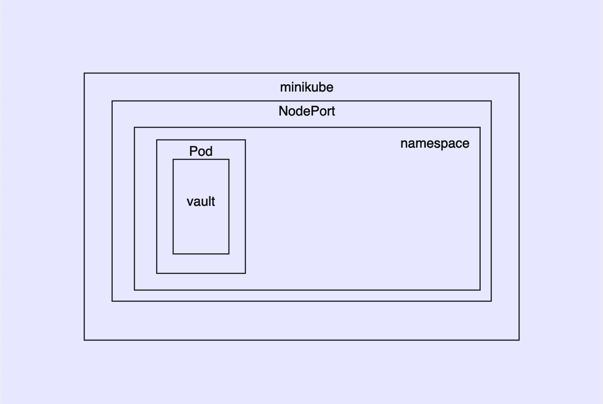

University: [ITMO University](https://itmo.ru/ru/)  
Faculty: [FICT](https://fict.itmo.ru)  
Course: [Introduction to distributed technologies](https://github.com/itmo-ict-faculty/introduction-to-distributed-technologies)  
Year: 2023/2024  
Group: K4110c  
Author: Soldatov Andrey Fedorovich  
Lab: Lab1  
Date of create: 12.10.2023  
Date of finished: 12.10.2023  


## Лабораторная работа №1 "Установка Docker и Minikube, мой первый манифест."
### Цель работы
Ознакомиться с инструментами Minikube и Docker, развернуть свой первый "под".
### Ход работы
Запуск minikube cluster
```
minikube start
```

``
Создание "namespace" с использованием файла HashiCorpVault-namespace.yaml
``
```
kubectl apply -f HashiCorpVault-namespace.yaml
```
  
При помощи команды ``minikube dashboard`` мы можем перейти по открывшейся ссылке в терминале и увидеть интерфейс Kubernetes Dashboard.  
``В верхней панели мы выбрали наш namespace в котором пока что пусто.``  
  

Далее перейдем к созданию "пода" с использованием файла HashiCorpVault-pod.yaml  
```
kubectl create -f HashiCorpVault-pod.yml 
```


Перейдем обратно к Kubernetes Dashboard и увидим, что наш под "vault" отображается в нашем namespace  


**Содержание манифеста**
```
apiVersion: v1
kind: Pod
metadata:
  name: vault
  namespace: lab1-namespace
  labels:
    app: vault
spec:
  containers:
  - name: vault
    image: hashicorp/vault
    ports:
      - containerPort: 8200
```   
После этого вам необходимо будет создать сервис для доступа к этому контейнеру  
```
minikube kubectl -- expose pod --namespace=lab1-namespace vault --type=NodePort
```
Далее мы хотим попасть в наш сервис, выполняем следующую команду:  
```
minikube kubectl -- port-forward --namespace=lab1-namespace service/vault 8200:8200
```  
Далее переходим по ссылке http://localhost:8200/  

Чтобы зайти в Vault, нужно достать токен, получить токен можно посмотрев на логи нашего пода  
```
kubectl logs --namespace=lab1-namespace vault  
```
  
Копируем Root Token и вставляем Token
   


```
Схема
```
  
