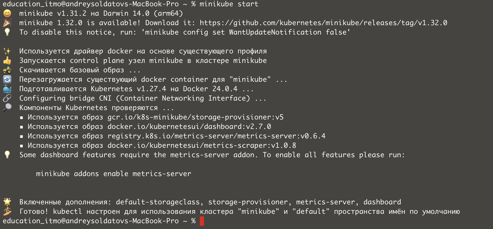

University: [ITMO University](https://itmo.ru/ru/)  
Faculty: [FICT](https://fict.itmo.ru)  
Course: [Introduction to distributed technologies](https://github.com/itmo-ict-faculty/introduction-to-distributed-technologies)  
Year: 2023/2024  
Group: K4110c  
Author: Soldatov Andrey Fedorovich    
Lab: Lab2       
Date of create: 07.11.2023  
Date of finished: 09.11.2023  


## Лабораторная работа №2 "Развертывание веб сервисов в Minikube, доступ к веб интерфейсу сервиса. Мониторинг сервиса"
### Цель работы
Ознакомиться с типами "контроллеров" развертывания контейнеров, ознакомится с сетевыми сервисами и развернуть свое веб приложение.

## Ход работы
Запуск minikube cluster
```
minikube start
```


После запуска minikube проверяем, что у нас не запущены поды, репликасеты и деплойменты.


Далее перейдем к манифесту который состоит из нескольких частей.


Здесь представлен Namespace и сам Deployment.


А здесь наш Service.

Перейдем к деплою нашего манифеста.

Запустим команду.  
```
kubectl apply -f frontend-deployment.yaml
```


После запуска команды видим, что мы задеплоили  

Далее проверим состояние наших компонентов при помощи команды:  
```
kubectl -n lab2-namespace get deploy,ns,service
```


Следующим шагом нужно пробросить порты.  
```
minikube kubectl -- port-forward -n lab2-namespace service/service-frontend 3000:3000
```
  

Далее перейдем по адресу ```http://localhost:3000``` и видим, что переменные из Deployment подтянуты и приложение работает.  

  

Далее смотрим имена наших подов и стоит посмотреть логи нашего приложения при помощи команды:  
```
kubectl -n lab2-namespace get pods
kubectl -n lab2-namespace logs frontend-deployment...
kubectl -n lab2-namespace logs frontend-deployment...
```
Вторая команда запускается дважды, так как мы смотрим логи двух контейнеров(replicas=2)

 


```
Схема
```
