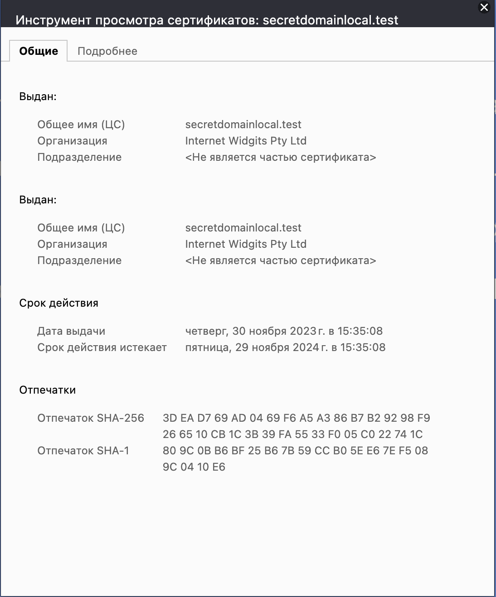

University: [ITMO University](https://itmo.ru/ru/)  
Faculty: [FICT](https://fict.itmo.ru)  
Course: [Introduction to distributed technologies](https://github.com/itmo-ict-faculty/introduction-to-distributed-technologies)  
Year: 2023/2024  
Group: K4110c  
Author: Soldatov Andrey Fedorovich    
Lab: Lab3  
Date of create: 20.11.2023  
Date of finished: 25.11.2023  

## Лабораторная работа №3 "Сертификаты и "секреты" в Minikube, безопасное хранение данных."

### Цель работы  
Познакомиться с сертификатами и "секретами" в Minikube, правилами безопасного хранения данных в Minikube.
### Ход работы
Запускаем minikube  
```
minikube start
```

После запуска создаем ConfigMap с переменными REACT_APP_USERNAME, REACT_APP_COMPANY_NAME и устанавливаем им значения.  


  


Далее нужно было создать replicaset с 2 репликами и используя созданный ранее ConfigMap передать значения в поды нашего репликасета.  
  

Запустим команду:  
```minikube dashboard```  
Откроется локальный веб интерфейс нашего кубера, перейдем во вкладку Pods, далее выберем из двух реплик один под и посмотрим на их environment variables.  
  
Мы убедились, что значения из ConfigMap были подтянуты для наших подов.  
Идем дальше, следующее, что требовалось сделать, это сгенерировать серты и импортировать их в миникуб.  
Используем openssl, запустим команды: 
```
openssl genrsa -out cert/domain.key 2048
openssl req -key cert/domain.key -new -out cert/domain.csr
openssl x509 -signkey cert/domain.key -in cert/domain.csr -req -days 365 -out cert/domain.crt
```  
  
Установим рандомное значение FQDN - secretdomainlocal.test
После этого используем команду для создания секретов и импорта в миникуб.
```
kubectl create secret tls tls-secret -o yaml --key=cert/domain.key --cert=cert/domain.crt > secret.yml
```
  
В файле secret.yaml можно установить свои значения для сертификата и ключа.  
Далее проверим подключен ли у нас ingress контроллер с помощью команды: 
```
minikube addons enable list
```
В появившемся списке видим, что дополнение ingress у нас уже установлено и команду ```minikube addons enable ingress``` можно не запускать, мы это сделали в прошлый раз.  
Далее запускаем наше сервис с помощью команды ```kubectl apply -f service.yaml```
  
Проверим запущен ли наш сервис ```kubectl get services```  
  
Видим, что сервис запущен.  
Далее запускаем наш ingress манифест с помощью команды ```kubectl apply -f lab3-ingress.yaml```  
  
Проверим, запустился или нет ```kubectl get ingress```
  
Далее используем команду ```minikube tunnel``` для того, чтобы подключиться к нашему сервису.  
  
Далее перейдем по адресу https://secretdomainlocal.test  
  
Сделав переход на по этому адресу видим, что наще приложение работает, переменные из ConfigMap были подтянуты.  
Обновим страничку и увидим, что запросы перераспределяются между подами.  
   

Далее представлены скрины информации по сертификату.  



Схема  
  
