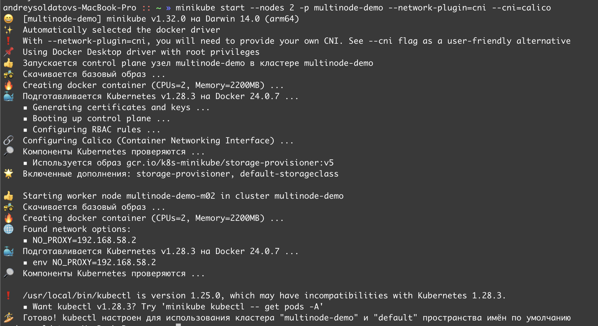

University: [ITMO University](https://itmo.ru/ru/)  
Faculty: [FICT](https://fict.itmo.ru)  
Course: [Introduction to distributed technologies](https://github.com/itmo-ict-faculty/introduction-to-distributed-technologies)  
Year: 2023/2024  
Group: K4110c  
Author: Soldatov Andrey Fedorovich  
Lab: Lab1  
Date of create: 04.11.2023  
Date of finished: 07.11.2023  


## Лабораторная работа №4 "Сети связи в Minikube, CNI и CoreDNS"
### Цель работы
Познакомиться с CNI Calico и функцией IPAM Plugin, изучить особенности работы CNI и CoreDNS.  
### Ход работы  
Запускаем minikube совместно с плагином calico и двумя нодами, как сказано в задании  
```
minikube start --nodes 2 -p multinode-demo --network-plugin=cni --cni=calico  
```  
  
Проверим наши ноды:  
```
kubectl get nodes  
```
  
Далее следует добавить label к каждой ноде:  
```
kubectl label pods multinode-demo location="Europe"  
kubectl label nodes multinode-demo-m02 location="Africa"
```  
Проверим label: 
```
kubectl get nodes --show-labels
```  
  

Далее посмотрим на ippool и удалим ippool по умолчанию по скольку он уже существует:  
```
calicoctl get ippool --allow-version-mismatch
```
  

```
alicoctl delete ippools default-ipv4-ippool --allow-version-mismatch 
```
  

Создадим новый ippool для каждой location:  
  
```
calicoctl create -f lab4-ippool.yaml --allow-version-mismatch
```

```
calicoctl get ippool -o wide --allow-version-mismatch
```


Далее задеплоим наши поды и сервис
```
kubectl apply -f frontend-deployment.yaml
```

  
Пробросим порты:  
```
kubectl port-forward svc/service-frontend 3000:3000
```
  
И перейдем по адресу ```http://localhost:3000```  
  

По заданию требовалось зайти на пингануть другой под:  
```
kubectl exec -it frontend-deployment-7b4975f5db-26fx9 sh
```
  


Схема


